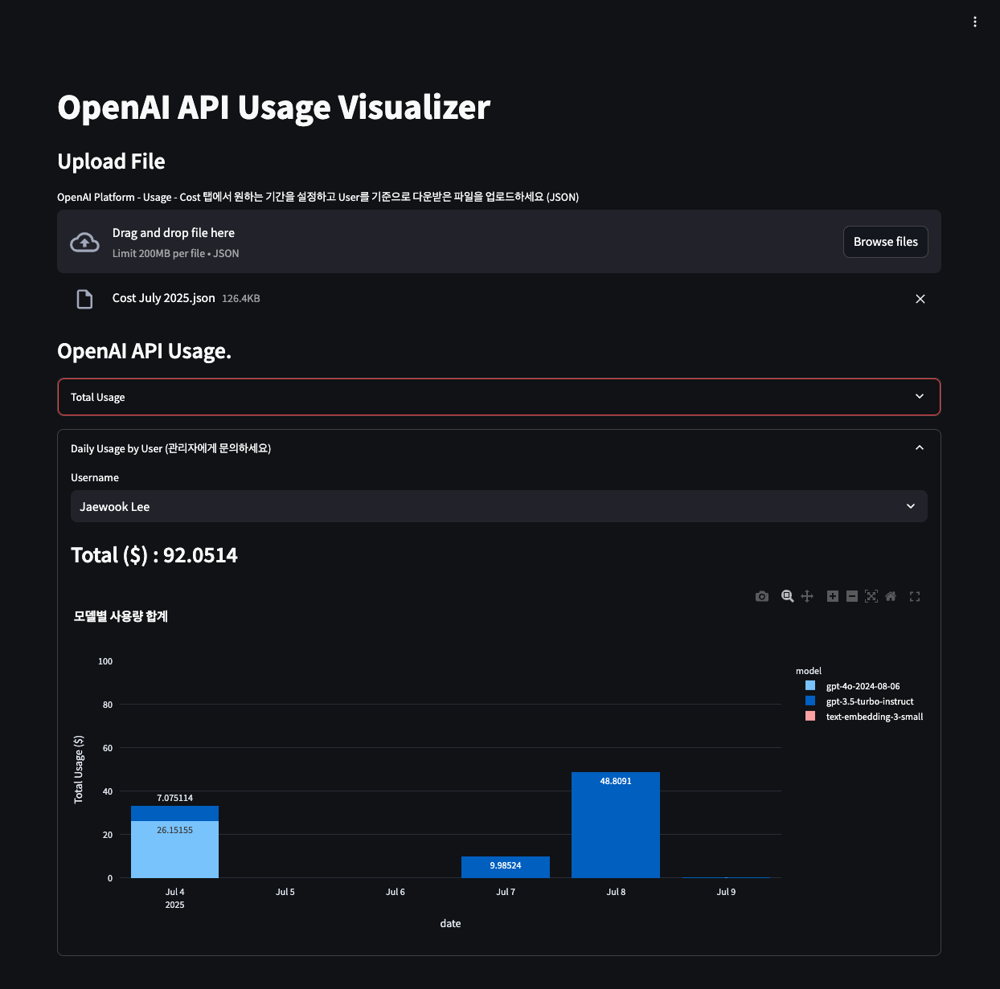

# OpenAI API Usage Tracker

OpenAI API 사용량을 시각화하고 분석하는 Streamlit 애플리케이션입니다.



## 주요 기능

- OpenAI API 사용량 업로드 및 분석
- 사용자별 총 사용량 조회
- 날짜별/모델별 사용량 시각화
- 인터랙티브 차트 및 그래프

## 2025년 구조 지원

이 프로젝트는 2025년 OpenAI API 데이터 구조만 지원합니다.
- 버킷 기반 데이터 구조 지원
- `line_item` 필드를 사용한 모델명 추출
- `amount.value` 필드를 사용한 비용 계산

## 설치 방법

1. 저장소 클론
```bash
git clone <repository-url>
cd OpenAITracker
```

2. 의존성 설치
```bash
pip install -r requirements.txt
```

3. 환경 변수 설정
   
   **방법 1: .env 파일 생성**
   ```bash
   # env.example 파일을 복사하여 .env 파일 생성
   cp env.example .env
   
   # .env 파일을 편집하여 실제 API 키 입력
   nano .env
   ```
   
   **방법 2: 직접 환경 변수 설정**
   ```bash
   export OPENAI_API_KEY="your-actual-api-key"
   export OPENAI_ORG_KEY="your-actual-org-key"
   export USERINFO_PATH="userinfo.json"
   export PORT=51075
   ```

## 환경 변수 설명

- `OPENAI_API_KEY`: OpenAI API 키 (필수)
- `OPENAI_ORG_KEY`: OpenAI 조직 키 (필수)
- `USERINFO_PATH`: 사용자 정보 파일 경로 (선택, 기본값: userinfo.json)
- `PORT`: 서버 포트 (선택, 기본값: 51075)

## 실행 방법

### 방법 1: 직접 실행
```bash
streamlit run app.py --server.port 51075
```

### 방법 2: 스크립트 실행
```bash
./run.sh
```

### 방법 3: main.py 사용
```bash
python main.py app.py --port 51075
```

## 사용 방법

1. 웹 브라우저에서 `http://localhost:51075` 접속
2. OpenAI Platform의 Usage > Cost 탭에서 JSON 파일 다운로드
3. 파일을 업로드하여 분석 시작

## 파일 구조

- `app.py`: 메인 Streamlit 애플리케이션
- `utils.py`: 데이터 처리 및 분석 함수들
- `main.py`: 애플리케이션 실행 스크립트
- `config.json`: 일반 설정 파일
- `run.sh`: 실행 스크립트
- `env.example`: 환경 변수 예시 파일
- `.gitignore`: Git 제외 파일 목록
- `requirements.txt`: Python 의존성 목록
