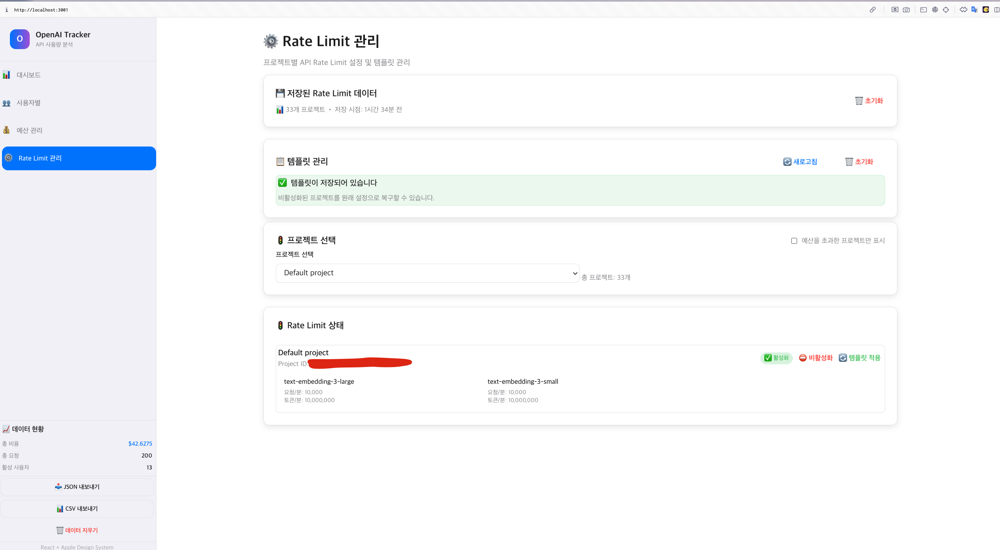

# OpenAI API Usage Tracker

OpenAI API 사용량을 시각화하고 분석하는 모던 웹 애플리케이션입니다. React 프론트엔드와 Python 백엔드를 제공하여 사용자 친화적인 인터페이스와 강력한 데이터 분석 기능을 제공합니다.



## 🎯 주요 기능

### React Frontend
- **Apple Design System**: 세련되고 현대적인 UI/UX
- **동적 네비게이션**: 업로드된 데이터 타입에 따른 탭 필터링
- **인터랙티브 차트**: Plotly를 활용한 실시간 데이터 시각화
- **아코디언 테이블**: 사용자별 상세 사용량을 확장 가능한 행으로 표시
- **반응형 디자인**: 모든 디바이스에서 최적화된 경험
- **실시간 상태 관리**: Zustand를 활용한 효율적인 상태 관리

### 데이터 분석 기능
- **사용자별 분석**: 개별 사용자의 API 사용 패턴 분석
- **프로젝트별 분석**: 프로젝트 단위 비용 및 사용량 추적
- **모델별 사용량**: GPT-4, GPT-3.5 등 모델별 상세 분석
- **일일 사용량 그래프**: 시간대별 사용 패턴 시각화
- **예산 관리**: 프로젝트별 예산 설정 및 모니터링

### 관리자 기능
- **API 키 관리**: 조직의 API 키 모니터링 및 관리
- **Rate Limit 설정**: 모델별 사용량 제한 설정
- **사용자 권한 관리**: 조직 멤버 및 권한 관리

## 🚀 기술 스택

### Frontend (React App)
- **React 18** with TypeScript
- **Vite** for development and building
- **Tailwind CSS** with Apple Design System
- **Zustand** for state management
- **Plotly.js** for interactive charts
- **React Dropzone** for file uploads

### Backend (Python)
- **Streamlit** for legacy web interface
- **FastAPI** for API server (org_api_server.py)
- **Python 3.8+** with asyncio support

## 🛠 설치 및 실행

### 완전한 실행 방법 (권장)

예산 관리 및 Rate Limit 관리 기능을 사용하려면 React Frontend와 Python Backend를 모두 실행해야 합니다.

#### 1. 환경 설정
```bash
# 저장소 클론
git clone https://github.com/jooinjang/OpenAI-API-Tracker.git
cd OpenAITracker

# 환경 변수 설정
cp env.example .env
# .env 파일을 편집하여 실제 OpenAI API 키와 조직 키 입력
```

#### 2. Python 의존성 설치
```bash
pip install -r requirements.txt
```

#### 3. React 의존성 설치
```bash
cd react-app
npm install
cd ..
```

#### 4. 서버 실행 (터미널 1)
```bash
uvicorn org_api_server:app --reload --port 8000
```

#### 5. React 앱 실행 (터미널 2)
```bash
cd react-app
npm run dev
```

React 앱은 `http://localhost:5173`에서 실행되며, 백엔드 API는 `http://localhost:8000`에서 실행됩니다.

### React Frontend만 실행 (기본 기능)

데이터 업로드 및 시각화만 사용하려면 React 앱만 실행할 수 있습니다.

```bash
cd react-app
npm install
npm run dev
```

### Python Backend (Streamlit - 레거시)

기존 Streamlit 인터페이스를 사용하려면:

```bash
streamlit run app.py --server.port 51075
```

## 📊 사용 방법

### 1. 기본 데이터 분석

1. **http://localhost:5173** 접속
2. 사이드바에서 데이터 업로드:
   - **사용자별 데이터**: OpenAI Platform > Usage > Cost에서 User 기준 JSON 다운로드
   - **프로젝트별 데이터**: OpenAI Platform > Usage > Cost에서 Project 기준 JSON 다운로드
3. 업로드된 데이터에 따라 동적으로 표시되는 탭 확인
4. 인터랙티브 차트와 데이터 분석 기능 활용

### 2. 고급 기능 사용 (백엔드 서버 필요)

#### 예산 관리
1. **💰 예산 관리** 탭 접속
2. 관리자 API 키 (Bearer 토큰) 입력
3. **"프로젝트 불러오기"** 클릭으로 조직의 프로젝트 목록 가져오기
4. 프로젝트별 예산 설정 및 사용량 모니터링

#### Rate Limit 관리
1. **⚙️ Rate Limit** 탭 접속
2. 관리자 API 키 입력
3. 프로젝트별 API 사용량 제한 설정 및 관리
4. 템플릿 저장/불러오기로 일관된 정책 적용

### 주요 UI 기능

- **📊 대시보드**: 전체 사용량 요약 및 주요 메트릭
- **👥 사용자별**: 개별 사용자 분석 및 아코디언 차트
- **🏗️ 프로젝트별**: 프로젝트 단위 분석 (프로젝트 데이터 업로드 시)
- **💰 예산 관리**: 프로젝트별 예산 설정 및 모니터링 (백엔드 필요)
- **⚙️ Rate Limit**: API 사용량 제한 관리 (백엔드 필요)

### 🔑 관리자 API 키 입력

예산 관리 및 Rate Limit 관리 기능을 사용하려면 OpenAI Organization의 관리자 API 키가 필요합니다:

1. [OpenAI Platform](https://platform.openai.com)에서 API 키 생성
2. 조직 관리 권한이 있는 키 사용
3. 앱에서 키 입력 시 `sk-` 또는 `sk-proj-`로 시작하는 키 사용
4. 키는 서버에만 전달되며 브라우저에 저장되지 않음

## 📁 프로젝트 구조

```
OpenAITracker/
├── react-app/                 # React Frontend
│   ├── src/
│   │   ├── components/        # UI 컴포넌트
│   │   │   ├── ui/           # 기본 UI 컴포넌트
│   │   │   ├── layout/       # 레이아웃 컴포넌트
│   │   │   └── views/        # 페이지 컴포넌트
│   │   ├── store/            # Zustand 상태 관리
│   │   ├── types/            # TypeScript 타입 정의
│   │   └── utils/            # 유틸리티 함수
│   ├── package.json          # 의존성 및 스크립트
│   └── tailwind.config.js    # Tailwind CSS 설정
├── app.py                    # 메인 Streamlit 애플리케이션
├── utils.py                  # 데이터 처리 함수들
├── org_api_server.py         # FastAPI 서버
├── components_design.py      # Apple Design System 컴포넌트
├── requirements.txt          # Python 의존성
└── README.md                # 프로젝트 문서
```

## 🎨 Design System

프로젝트는 Apple의 디자인 원칙을 따르는 일관된 디자인 시스템을 사용합니다:

- **색상**: Apple의 시스템 색상 팔레트 사용
- **타이포그래피**: SF Pro 글꼴 패밀리 지원
- **간격**: Apple의 8px 그리드 시스템
- **애니메이션**: 자연스럽고 부드러운 트랜지션
- **접근성**: WCAG 가이드라인 준수

## 🚨 문제 해결

### "Failed to fetch" 에러

예산 관리 또는 Rate Limit 관리에서 이 에러가 발생하면:

1. **백엔드 서버 실행 확인**:
   ```bash
   uvicorn org_api_server:app --reload --port 8000
   ```

2. **CORS 설정 확인**: `org_api_server.py`에서 `localhost:5173`이 허용되는지 확인

3. **API 키 형식 확인**: `sk-` 또는 `sk-proj-`로 시작하는 올바른 키 사용

4. **네트워크 연결**: `http://localhost:8000/health`에서 서버 상태 확인

### 프로젝트 목록이 로드되지 않을 때

1. 관리자 API 키에 조직 관리 권한이 있는지 확인
2. OpenAI 조직 설정에서 API 키 권한 확인
3. 브라우저 개발자 도구 콘솔에서 상세 에러 메시지 확인

## 🔧 개발 정보

### 지원하는 OpenAI 데이터 구조 (2025)

- **버킷 기반 데이터 구조** 지원
- **`line_item`** 필드를 사용한 모델명 추출
- **`amount.value`** 필드를 사용한 비용 계산
- **사용자별/프로젝트별** 데이터 구조 모두 지원

### 환경 변수

백엔드 서버 실행을 위해 `.env` 파일에 다음 변수들을 설정해야 합니다:

```bash
OPENAI_API_KEY=your-actual-api-key        # OpenAI API 키 (예산/Rate Limit 관리용)
OPENAI_ORG_KEY=your-actual-org-key        # OpenAI 조직 키 (필수)
USERINFO_PATH=userinfo.json               # 사용자 정보 파일 경로
PORT=51075                                # Streamlit 서버 포트
```

⚠️ **주의**: 예산 관리 및 Rate Limit 관리 기능 사용 시 UI에서 입력하는 관리자 키는 위 환경 변수와 별개입니다.

## 🤝 기여하기

1. 이 저장소를 Fork
2. Feature 브랜치 생성 (`git checkout -b feature/AmazingFeature`)
3. 변경사항 커밋 (`git commit -m 'Add some AmazingFeature'`)
4. 브랜치에 푸시 (`git push origin feature/AmazingFeature`)
5. Pull Request 생성

## 📄 라이선스

이 프로젝트는 MIT 라이선스 하에 배포됩니다.

## 🙋‍♂️ 지원

문제가 발생하거나 질문이 있으시면 [Issues](https://github.com/jooinjang/OpenAI-API-Tracker/issues)에서 문의해주세요.
